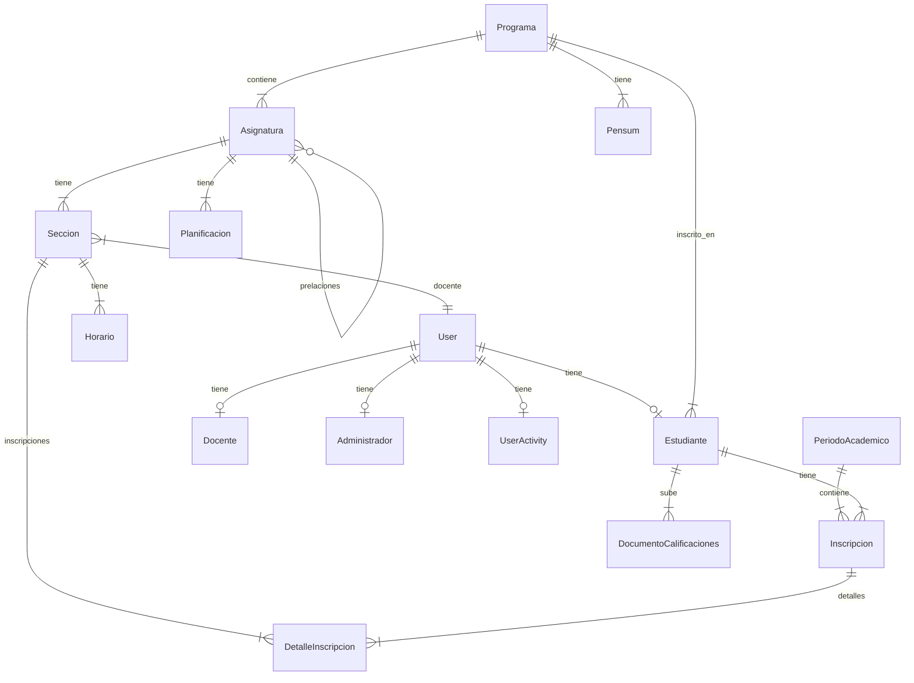

# 📚 Documentación Completa del Proyecto SISMEPA

## Índice
1. [Descripción General](#descripción-general)
2. [Stack Tecnológico](#stack-tecnológico)
3. [Estructura del Proyecto](#estructura-del-proyecto)
4. [Backend (Django)](#backend-django)
   - [Configuración](#configuración-sismepa)
   - [Modelos de Datos](#modelos-de-datos)
   - [API REST (Views)](#api-rest-views)
   - [Serializers](#serializers)
   - [Permisos](#permisos)
   - [Notificaciones](#notificaciones)
   - [Signals](#signals)
   - [Middleware](#middleware)
   - [Utilidades](#utilidades)
5. [Frontend (React)](#frontend-react)
   - [Arquitectura](#arquitectura-frontend)
   - [Servicio API](#servicio-api)
   - [Páginas](#páginas)
   - [Componentes](#componentes)
6. [Scripts de Utilidad](#scripts-de-utilidad)
7. [Archivos Docker](#archivos-docker)
8. [Algoritmos Clave](#algoritmos-clave)

---

## Descripción General

**SISMEPA** = **S**istema de **M**onitoreo de Avance **E**ducativo Universitario y **P**relaciones **A**cadémicas

Es un sistema web completo para gestionar y monitorear el avance académico de estudiantes universitarios de la UNEFA. Funcionalidades principales:

- 📊 **Monitoreo de Progreso**: Seguimiento del avance académico por semestre
- 📅 **Gestión de Horarios**: Asignación de docentes a secciones con horarios
- 📝 **Inscripción de Materias**: Sistema de inscripción con validación de prelaciones
- 👨‍🏫 **Gestión de Calificaciones**: Carga de notas por docentes (4 cortes)
- 📧 **Alertas Automáticas**: Notificaciones de riesgo académico via email
- 👥 **Roles de Usuario**: Administrador, Docente, Estudiante

---

## Stack Tecnológico

| Capa | Tecnología | Versión |
|------|------------|---------|
| **Backend** | Django + DRF | 5.2+ |
| **Frontend** | React + Vite | 18+ |
| **Estilos** | TailwindCSS | 3+ |
| **Base de Datos** | PostgreSQL | 15+ |
| **Autenticación** | dj-rest-auth + Token | - |
| **Email** | Django SMTP / SendGrid | - |
| **Containerización** | Docker + Compose | - |

---

## Estructura del Proyecto

```
SISMEPA/
├── sismepa/                # ⚙️ Configuración Django
│   ├── settings.py         # Configuración principal
│   ├── urls.py             # Rutas de API
│   ├── middleware.py       # Middleware personalizado
│   └── wsgi.py / asgi.py   # Interfaces de servidor
├── gestion/                # 📦 Aplicación Principal
│   ├── models.py           # 11 Modelos de datos
│   ├── admin.py            # Configuración admin Django
│   ├── api/                # API REST
│   │   ├── views.py        # 11 ViewSets (~2600 líneas)
│   │   └── serializers.py  # 14 Serializers
│   ├── permissions.py      # 5 Clases de permisos
│   ├── notifications.py    # Sistema de emails
│   ├── signals.py          # Señales automáticas
│   └── utils.py            # Utilidades Excel
├── frontend/               # 🎨 Aplicación React
│   ├── src/
│   │   ├── App.jsx         # Router principal
│   │   ├── pages/          # 8 Páginas
│   │   ├── components/     # Componentes reutilizables
│   │   ├── services/       # Capa API (api.js)
│   │   ├── context/        # React Context (Theme)
│   │   └── layouts/        # Layout con Sidebar
│   └── package.json        # Dependencias npm
├── scripts/                # 🔧 Scripts de utilidad
├── docker-compose.yml      # Orquestación
└── requirements.txt        # Dependencias Python
```

---

## Backend (Django)

### Configuración (sismepa/)

#### [settings.py](file:///c:/Users/leona/Documents/GitHub/SISMEPA/sismepa/settings.py)
Archivo central de configuración (~270 líneas):

```python
# Variables de entorno clave
SECRET_KEY = os.environ.get('SECRET_KEY', '...')
DEBUG = os.environ.get('DJANGO_DEBUG', 'True') == 'True'
ALLOWED_HOSTS = ['*']

# Apps instaladas
INSTALLED_APPS = [
    'corsheaders',           # CORS headers
    'rest_framework',        # API REST
    'rest_framework.authtoken',
    'allauth',              # Autenticación
    'dj_rest_auth',         # Endpoints auth
    'django_filters',       # Filtros en API
    'gestion',              # App principal
]

# Configuración REST Framework
REST_FRAMEWORK = {
    'DEFAULT_AUTHENTICATION_CLASSES': (
        'rest_framework.authentication.TokenAuthentication',
        'rest_framework.authentication.SessionAuthentication',
    ),
    'DEFAULT_PERMISSION_CLASSES': (
        'rest_framework.permissions.IsAuthenticatedOrReadOnly',
    ),
}

# Base de datos PostgreSQL
DATABASES = {
    'default': {
        'ENGINE': 'django.db.backends.postgresql',
        'NAME': os.environ.get('POSTGRES_DB', 'unefa_monitoring_db'),
        ...
    }
}

# Email para notificaciones
EMAIL_BACKEND = 'django.core.mail.backends.smtp.EmailBackend'
EMAIL_HOST = os.environ.get('EMAIL_HOST', 'smtp.gmail.com')

# Umbral de bajo rendimiento (%)
LOW_PERFORMANCE_THRESHOLD = int(os.environ.get('LOW_PERFORMANCE_THRESHOLD', '50'))
```

#### [urls.py](file:///c:/Users/leona/Documents/GitHub/SISMEPA/sismepa/urls.py)
Definición de rutas API usando `DefaultRouter`:

```python
router = DefaultRouter()
router.register(r'estudiantes', EstudianteViewSet)
router.register(r'programas', ProgramaViewSet)
router.register(r'asignaturas', AsignaturaViewSet)
router.register(r'pensums', PensumViewSet)
router.register(r'planificaciones', PlanificacionViewSet)
router.register(r'calificaciones', DocumentoCalificacionesViewSet)
router.register(r'admin-users', UserManagementViewSet)
router.register(r'docentes', DocenteViewSet)
router.register(r'administradores', AdminViewSet)
router.register(r'secciones', SeccionViewSet)
router.register(r'periodos', PeriodoAcademicoViewSet)
router.register(r'estadisticas', EstadisticasViewSet)

urlpatterns = [
    path('admin/', admin.site.urls),
    path('api/', include(router.urls)),
    path('api/auth/', include('dj_rest_auth.urls')),  # login/logout
    path('api/online-users/', OnlineUsersView.as_view()),
]
```

---

### Modelos de Datos

Archivo: [models.py](file:///c:/Users/leona/Documents/GitHub/SISMEPA/gestion/models.py) (~241 líneas)



#### 1. `PeriodoAcademico`
Representa un semestre/período académico.

| Campo | Tipo | Descripción |
|-------|------|-------------|
| `nombre_periodo` | CharField(50) | Ej: "2025-1" |
| `fecha_inicio` | DateField | Inicio del período |
| `fecha_fin` | DateField | Fin del período |
| `activo` | Boolean | Si es el período actual |
| `inscripciones_activas` | Boolean | Si permite inscripciones |
| `anio` | Integer | Año del período |

#### 2. `Programa`
Carrera universitaria.

| Campo | Tipo | Descripción |
|-------|------|-------------|
| `nombre_programa` | CharField(200) | Ej: "Ingeniería en Sistemas" |
| `titulo_otorgado` | CharField(200) | Ej: "Ingeniero en Sistemas" |
| `duracion_anios` | Integer | Duración en años (ej: 5) |

#### 3. `Asignatura`
Materia del pensum.

| Campo | Tipo | Descripción |
|-------|------|-------------|
| `nombre_asignatura` | CharField(200) | Nombre completo |
| `codigo` | CharField(20) | Código único (ej: "MAT-101") |
| `creditos` | Integer | Unidades de crédito (UC) |
| `semestre` | Integer | Semestre (1-10) |
| `programa` | FK(Programa) | Carrera a la que pertenece |
| `prelaciones` | M2M(self) | Materias prerrequisito |
| `orden` | Integer | Orden de visualización |
| `docente` | FK(User) | Docente asignado (legacy) |
| `tutores` | M2M(User) | Tutores adicionales |

#### 4. `Seccion`
Sección de una asignatura (ej: D1, D2).

| Campo | Tipo | Descripción |
|-------|------|-------------|
| `asignatura` | FK(Asignatura) | Materia |
| `codigo_seccion` | CharField(10) | Ej: "D1" |
| `docente` | FK(User) | Profesor asignado |

#### 5. `Estudiante`
Perfil de estudiante vinculado a User.

| Campo | Tipo | Descripción |
|-------|------|-------------|
| `usuario` | OneToOne(User) | Usuario del sistema |
| `programa` | FK(Programa) | Carrera inscrita |
| `cedula` | CharField(20) | Documento de identidad (único) |
| `telefono` | CharField(20) | Teléfono de contacto |
| `fecha_ingreso` | DateField | Fecha automática |
| `nombre/apellido/email` | Campos auxiliares | Redundancia para consultas |

**Métodos importantes:**
- `calcular_avance()`: Calcula % de materias aprobadas
- `get_uc_periodo_actual()`: Suma UC inscritas en período activo

#### 6. `Docente`
Perfil de profesor.

| Campo | Tipo | Descripción |
|-------|------|-------------|
| `usuario` | OneToOne(User) | Usuario del sistema |
| `cedula` | CharField(20) | Documento único |
| `telefono` | CharField(20) | Contacto |
| `tipo_contratacion` | Choice | "Tiempo Completo" / "Tiempo Parcial" |

#### 7. `Administrador`
Perfil de administrador (es superusuario).

| Campo | Tipo | Descripción |
|-------|------|-------------|
| `usuario` | OneToOne(User) | Usuario con is_staff=True |
| `cedula` | CharField(20) | Documento único |
| `telefono` | CharField(20) | Contacto |

#### 8. `Inscripcion`
Registro de inscripción de estudiante en período.

| Campo | Tipo | Descripción |
|-------|------|-------------|
| `estudiante` | FK(Estudiante) | Estudiante |
| `periodo` | FK(PeriodoAcademico) | Período académico |
| `fecha_inscripcion` | DateTime | Fecha automática |

#### 9. `DetalleInscripcion`
Cada materia inscrita con sus notas.

| Campo | Tipo | Descripción |
|-------|------|-------------|
| `inscripcion` | FK(Inscripcion) | Inscripción padre |
| `asignatura` | FK(Asignatura) | Materia inscrita |
| `seccion` | FK(Seccion) | Sección asignada |
| `nota1..nota4` | Decimal(4,2) | Notas parciales (1-20) |
| `nota_reparacion` | Decimal(4,2) | Nota de reparación (opcional) |
| `nota_final` | Decimal(4,2) | Promedio calculado o nota de reparación |
| `estatus` | CharField(20) | CURSANDO/APROBADO/REPROBADO |

**Algoritmo `calcular_nota_final()`:**
```python
def calcular_nota_final(self):
    # Si hay nota de reparación, esta sustituye la nota final
    if self.nota_reparacion is not None:
        self.nota_final = self.nota_reparacion
        self.estatus = 'APROBADO' if self.nota_final >= 10 else 'REPROBADO'
        return self.nota_final
    
    # Si no, calcular promedio de las 4 notas parciales
    notas = [n for n in [self.nota1..4] if n is not None]
    if len(notas) == 4:
        self.nota_final = sum(notas) / 4
        self.estatus = 'APROBADO' if self.nota_final >= 10 else 'REPROBADO'
    return self.nota_final
```

> [!NOTE]
> **Nota de Reparación (Nota R):** Esta nota solo puede cargarse cuando el estudiante está reprobado (promedio < 10 con las 4 notas cargadas). Al cargarse, sustituye completamente la nota final sin afectar las notas parciales.

#### 10. `Horario`
Bloques de horario de una sección.

| Campo | Tipo | Descripción |
|-------|------|-------------|
| `seccion` | FK(Seccion) | Sección |
| `dia` | Integer | 1-7 (Lunes-Domingo) |
| `hora_inicio/fin` | TimeField | Rango horario |
| `aula` | CharField(50) | Salón asignado |

#### 11. `UserActivity`
Seguimiento de actividad en línea.

| Campo | Tipo | Descripción |
|-------|------|-------------|
| `user` | OneToOne(User) | Usuario |
| `last_activity` | DateTime | Última actividad |
| `ip_address` | GenericIPAddress | IP del cliente |
| `device_type` | CharField | "Desktop" / "Mobile" |

#### Otros modelos auxiliares:
- `DocumentoCalificaciones`: PDFs subidos por estudiantes
- `Pensum`: Documentos del pensum por programa
- `Planificacion`: Planificaciones subidas por docentes

---

### API REST (Views)

Archivo: [views.py](file:///c:/Users/leona/Documents/GitHub/SISMEPA/gestion/api/views.py) (~2637 líneas)

#### 1. `EstudianteViewSet`
Gestión completa de estudiantes.

| Endpoint | Método | Descripción |
|----------|--------|-------------|
| `/estudiantes/` | GET | Listar estudiantes |
| `/estudiantes/{id}/` | GET | Detalle estudiante |
| `/estudiantes/{id}/progreso/` | GET | % avance académico |
| `/estudiantes/mis-inscripciones/` | GET | Materias inscritas del usuario |
| `/estudiantes/mi-info/` | GET | Info + UC del período |
| `/estudiantes/mi-horario/` | GET | Horario personal |
| `/estudiantes/descargar-horario/` | GET | Excel del horario |
| `/estudiantes/descargar-progreso-academico/` | GET | Excel progreso |
| `/estudiantes/reporte-excel/` | GET | Reporte masivo |

**Algoritmo de generación de horario Excel (400+ líneas):**
- Genera matriz de 7 días × 15 bloques
- Calcula rowspan para celdas que abarcan múltiples bloques
- Aplica estilos profesionales (bordes, colores, merge)

#### 2. `AsignaturaViewSet`
Gestión de materias y asignaciones.

| Endpoint | Método | Descripción |
|----------|--------|-------------|
| `/asignaturas/` | GET | Listar con filtros |
| `/asignaturas/{id}/assign-docente/` | POST | Asignar docente a sección |
| `/asignaturas/{id}/assign-tutor/` | POST | Agregar tutor |
| `/asignaturas/{id}/remove-tutor/` | POST | Remover tutor |

#### 3. `SeccionViewSet` (CENTRAL)
El ViewSet más complejo (~1100 líneas).

| Endpoint | Método | Descripción |
|----------|--------|-------------|
| `/secciones/` | GET | Listar secciones |
| `/secciones/master-horario/` | GET | Horario maestro filtrable |
| `/secciones/descargar-master-horario/` | GET | Excel horario maestro |
| `/secciones/{id}/estudiantes/` | GET | Lista de inscritos |
| `/secciones/{id}/descargar-listado/` | GET | Excel lista |
| `/secciones/{id}/inscribir-estudiante/` | POST | Admin/Docente inscribe |
| `/secciones/{id}/inscribirme/` | POST | Auto-inscripción |
| `/secciones/{id}/desinscribirme/` | POST | Auto-desinscripción |
| `/secciones/{id}/desinscribir-estudiante/` | POST | Admin remueve |
| `/secciones/mis-secciones/` | GET | Secciones del docente |
| `/secciones/{id}/calificar/` | POST | Cargar notas |

**Algoritmo de inscripción (`_inscribir_estudiante_en_seccion`):**
```python
def _inscribir_estudiante_en_seccion(self, estudiante, seccion, allow_conflicts=False):
    # 1. Verificar inscripciones activas
    if not PeriodoAcademico.objects.filter(activo=True, inscripciones_activas=True).exists():
        raise ValidationError("Las inscripciones no están activas")
    
    # 2. Verificar prelaciones
    prelaciones_no_aprobadas = []
    for prereq in seccion.asignatura.prelaciones.all():
        if not DetalleInscripcion.objects.filter(
            inscripcion__estudiante=estudiante,
            asignatura=prereq,
            estatus='APROBADO'
        ).exists():
            prelaciones_no_aprobadas.append(prereq.codigo)
    
    if prelaciones_no_aprobadas:
        raise ValidationError(f"Falta aprobar: {', '.join(prelaciones_no_aprobadas)}")
    
    # 3. Verificar límite UC (35)
    uc_actuales = estudiante.get_uc_periodo_actual()
    uc_materia = seccion.asignatura.creditos
    if uc_actuales + uc_materia > 35:
        raise ValidationError(f"Excede límite de 35 UC ({uc_actuales + uc_materia})")
    
    # 4. Verificar conflictos de horario
    if not allow_conflicts:
        # Comparar horarios de materias ya inscritas
        ...
    
    # 5. Crear inscripción
    inscripcion, _ = Inscripcion.objects.get_or_create(
        estudiante=estudiante,
        periodo=periodo_activo
    )
    DetalleInscripcion.objects.create(
        inscripcion=inscripcion,
        asignatura=seccion.asignatura,
        seccion=seccion,
        estatus='CURSANDO'
    )
```

#### 4. `PeriodoAcademicoViewSet`
Gestión de períodos académicos.

| Endpoint | Método | Descripción |
|----------|--------|-------------|
| `/periodos/activo/` | GET | Período actual |
| `/periodos/{id}/toggle-inscripciones/` | POST | Abrir/cerrar inscripciones |
| `/periodos/{id}/activar-periodo/` | POST | Establecer como activo |

#### 5. `EstadisticasViewSet`
Dashboard y reportes.

| Endpoint | Método | Descripción |
|----------|--------|-------------|
| `/estadisticas/chart-data/` | GET | Datos para gráfico radar |
| `/estadisticas/desglose/` | GET | Desglose por semestre/sección |
| `/estadisticas/descargar-desglose-excel/` | GET | Excel reporte |
| `/estadisticas/mi-progreso/` | GET | Progreso del estudiante |

#### Otros ViewSets:
- `ProgramaViewSet`: CRUD de programas
- `DocenteViewSet`: Lista docentes + Excel
- `AdminViewSet`: Lista admins + Excel
- `PensumViewSet`: Upload/download pensums
- `PlanificacionViewSet`: Planificaciones de docentes
- `DocumentoCalificacionesViewSet`: Docs de estudiantes
- `UserManagementViewSet`: Creación de usuarios
- `OnlineUsersView`: Usuarios activos en últimos 5 min

---

### Serializers

Archivo: [serializers.py](file:///c:/Users/leona/Documents/GitHub/SISMEPA/gestion/api/serializers.py) (~419 líneas)

| Serializer | Modelo | Campos especiales |
|------------|--------|-------------------|
| `UserSerializer` | User | `telefono` (de perfil relacionado) |
| `CreateUserSerializer` | User | Crea usuario + perfil según rol |
| `EstudianteSerializer` | Estudiante | `nombre_completo`, write_only para update |
| `DocenteSerializer` | Docente | Similar estructura |
| `AdministradorSerializer` | Administrador | Similar estructura |
| `AsignaturaSerializer` | Asignatura | `secciones`, `has_plan`, `prelaciones` |
| `SeccionSerializer` | Seccion | `horarios`, `estudiantes_count` |
| `HorarioSerializer` | Horario | `dia_nombre` |
| `PeriodoAcademicoSerializer` | PeriodoAcademico | `es_pasado`, `es_futuro`, `estado` |
| `PensumSerializer` | Pensum | Validación MIME tipo |
| `PlanificacionSerializer` | Planificacion | Validación archivo |
| `DocumentoCalificacionesSerializer` | Documento | Solo PDFs |

**Validación de archivos:**
```python
def validate_archivo(self, value):
    # 1. Verificar tamaño máximo
    if value.size > 10 * 1024 * 1024:  # 10MB
        raise ValidationError("Archivo demasiado grande")
    
    # 2. Verificar tipo MIME con python-magic
    try:
        import magic
        mime = magic.from_buffer(value.read(2048), mime=True)
        if mime not in allowed_mimes:
            raise ValidationError("Tipo no permitido")
    except:
        # Fallback: verificar extensión
        ext = os.path.splitext(value.name)[1].lower()
        if ext not in allowed_ext:
            raise ValidationError("Extensión no permitida")
```

---

### Permisos

Archivo: [permissions.py](file:///c:/Users/leona/Documents/GitHub/SISMEPA/gestion/permissions.py) (~66 líneas)

| Clase | Lógica |
|-------|--------|
| `IsAdmin` | `is_superuser` O grupo "Administrador" |
| `IsDocente` | Grupo "Docente" O `is_superuser` |
| `IsEstudiante` | Grupo "Estudiante" O `is_superuser` |
| `IsDocenteOrAdminOrOwner` | Docente/Admin O dueño del recurso |
| `IsDocenteOrAdmin` | Docente O Administrador O superuser |

---

### Notificaciones

Archivo: [notifications.py](file:///c:/Users/leona/Documents/GitHub/SISMEPA/gestion/notifications.py) (~145 líneas)

#### Funciones de email:

| Función | Trigger | Destinatario |
|---------|---------|--------------|
| `notify_student_period_start` | Activación período | Estudiantes |
| `notify_student_risk` | Nota parcial baja | Estudiante en riesgo |
| `notify_student_failure` | nota_final < 10 | Estudiante reprobado |
| `notify_docente_assignment` | Asignación sección | Docente |
| `notify_docente_period_end` | Fin período | Docentes |
| `notify_admin_period_status` | Cierre/apertura | Administrador |

**Ejemplo email de riesgo:**
```
Hola {nombre},

Hemos detectado que tu rendimiento actual en {asignatura} presenta riesgo.
Tu nota parcial acumulada es: {nota_actual:.2f}
Para aprobar necesitas obtener: {nota_necesaria:.2f} pts.

Atentamente,
Sistema de Alerta Temprana - SISMEPA
```

---

### Signals

Archivo: [signals.py](file:///c:/Users/leona/Documents/GitHub/SISMEPA/gestion/signals.py) (~81 líneas)

| Signal | Modelo | Acción |
|--------|--------|--------|
| `post_migrate` | - | Crea grupos default (Estudiante/Docente/Admin) |
| `post_save` PeriodoAcademico | PeriodoAcademico | Notifica estudiantes si se activa |
| `post_save` DetalleInscripcion | DetalleInscripcion | Verifica riesgo/reprobación |
| `user_signed_up` (allauth) | User | Asigna grupo "Estudiante" por defecto |

**Algoritmo de predicción de riesgo:**
```python
@receiver(post_save, sender=DetalleInscripcion)
def risk_notification(sender, instance, **kwargs):
    if instance.estatus in ['CURSANDO', 'REPROBADO']:
        notas = [n for n in [nota1..4] if n is not None]
        
        if len(notas) == 3:
            # Predicción: ¿cuánto necesita en la 4ta nota?
            necesario = 40 - sum(notas)  # Para promediar 10
            if necesario >= 15:  # Muy difícil
                notify_student_risk(estudiante, asignatura, promedio, necesario)
        
        elif len(notas) == 4:
            if sum(notas) / 4 < 10:
                notify_student_failure(estudiante, asignatura, nota_final)
```

---

### Middleware

Archivo: [middleware.py](file:///c:/Users/leona/Documents/GitHub/SISMEPA/sismepa/middleware.py) (~57 líneas)

#### `UpdateLastActivityMiddleware`
Actualiza `UserActivity` en cada request.

**Optimizaciones:**
- Throttle de 2 minutos (no actualiza si pasaron < 2 min)
- Detecta IP (X-Forwarded-For para proxies)
- Detecta dispositivo (Mobile/Desktop via User-Agent)

---

### Utilidades

Archivo: [utils.py](file:///c:/Users/leona/Documents/GitHub/SISMEPA/gestion/utils.py) (~147 líneas)

#### `apply_excel_styling(ws, header_row_num, custom_widths)`
Aplica estilo profesional a hojas Excel:

1. **Título (Fila 1)**: Fondo gris, negrita, centrado, merge
2. **Metadata (Filas 2-header)**: Bordes, etiquetas en negrita
3. **Tabla (Desde header)**: Bordes, encabezados grises, auto-width
4. **Anchos de columna**: Cálculo automático basado en contenido

---

## Frontend (React)

### Arquitectura Frontend

```
frontend/src/
├── main.jsx           # Entry point
├── App.jsx            # Router + ErrorBoundary
├── index.css          # TailwindCSS base
├── services/
│   └── api.js         # Capa HTTP centralizada
├── context/
│   └── ThemeContext.jsx  # Tema claro/oscuro
├── layouts/
│   └── AdminLayout.jsx   # Layout con Sidebar
├── components/
│   ├── Sidebar.jsx       # Navegación lateral
│   ├── Dashboard.jsx     # Componente principal
│   └── ThemeToggle.jsx   # Switch tema
└── pages/
    ├── LoginPage.jsx
    ├── PensumPage.jsx
    ├── CalificacionesPage.jsx
    ├── HorarioPage.jsx
    ├── ListadoPage.jsx
    ├── ProfilePage.jsx
    ├── RegisterUserPage.jsx
    └── ActiveUsersPage.jsx
```

### Servicio API

Archivo: [api.js](file:///c:/Users/leona/Documents/GitHub/SISMEPA/frontend/src/services/api.js)

```javascript
const BASE_URL = import.meta.env.VITE_API_URL || 'http://localhost:8000/api';

export async function apiCall(endpoint, options = {}) {
    const headers = {
        'Content-Type': 'application/json',
    };
    
    // Inyectar token si existe
    const token = localStorage.getItem('apiToken');
    if (token) {
        headers['Authorization'] = `Token ${token}`;
    }
    
    const response = await fetch(`${BASE_URL}${endpoint}`, { ...options, headers });
    return response;
}

export default {
    get: (endpoint) => apiCall(endpoint, { method: 'GET' }),
    post: (endpoint, body) => apiCall(endpoint, { method: 'POST', body: JSON.stringify(body) }),
    put: (endpoint, body) => apiCall(endpoint, { method: 'PUT', body: JSON.stringify(body) }),
    patch: (endpoint, body) => apiCall(endpoint, { method: 'PATCH', body: JSON.stringify(body) }),
    delete: (endpoint) => apiCall(endpoint, { method: 'DELETE' }),
};
```

### Páginas

#### 1. [LoginPage.jsx](file:///c:/Users/leona/Documents/GitHub/SISMEPA/frontend/src/pages/LoginPage.jsx) (176 líneas)
- Login con cédula + contraseña
- Validación numérica de cédula
- Almacena token y userData en localStorage
- Redirección automática al dashboard

#### 2. [PensumPage.jsx](file:///c:/Users/leona/Documents/GitHub/SISMEPA/frontend/src/pages/PensumPage.jsx) (1507 líneas)
**La página más compleja del sistema.**

Funcionalidades por rol:
- **Estudiante**: Ver pensum, inscribirse/desinscribirse
- **Docente**: Subir planificaciones
- **Admin**: Asignar docentes, gestionar secciones

Listas de electivas hardcodeadas:
```javascript
const ELECTIVAS_TECNICAS_TELECOM = [
    { code: 'ETE-31113', name: 'COMUNICACIONES INALÁMBRICAS' },
    { code: 'ETE-31123', name: 'COMUNICACIONES ÓPTICAS' },
    ...
];
const ELECTIVAS_NO_TECNICAS = [...];
const ACTIVIDADES_CULTURALES = [...];
const ACTIVIDADES_DEPORTIVAS = [...];
```

Funciones principales:
| Función | Descripción |
|---------|-------------|
| `fetchMisInscripciones` | Obtiene estado de materias inscritas |
| `getEnrollmentStatus` | Retorna estatus por código |
| `handleSubjectClick` | Abre modal de acciones |
| `handleAssignDocente` | Asigna docente a sección |
| `handleInscribirme` | Auto-inscripción a sección |
| `handleDesinscribirme` | Retira inscripción |
| `handleUploadClick` | Subir planificación |
| `renderModalActions` | Renderiza botones según rol |

#### 3. [CalificacionesPage.jsx](file:///c:/Users/leona/Documents/GitHub/SISMEPA/frontend/src/pages/CalificacionesPage.jsx) (823 líneas)
Gestión de calificaciones para docentes.

- Lista secciones asignadas al docente
- Expandir/colapsar por materia
- Tabla de notas (nota1-4)
- Cálculo de promedio en tiempo real
- Guardar notas masivamente
- Agregar/eliminar estudiantes
- Descarga Excel del listado

#### 4. [HorarioPage.jsx](file:///c:/Users/leona/Documents/GitHub/SISMEPA/frontend/src/pages/HorarioPage.jsx) (718 líneas)
Visualización de horarios.

**Vista Estudiante:**
- Horario personal (materias inscritas)
- Descarga Excel

**Vista Admin/Docente:**
- Horario maestro filtrable
- Filtros: Programa, Semestre, Sección
- Descarga Excel completo

Algoritmo de renderizado:
```javascript
renderCell(diaId, bloqueId) {
    // 1. Buscar clases que intersectan este bloque
    const matches = horarioData.filter(item => 
        item.dia === diaId && 
        toMinutes(item.hora_inicio) <= bloqueStart &&
        toMinutes(item.hora_fin) > bloqueStart
    );
    
    // 2. Calcular rowspan
    const duracion = toMinutes(item.hora_fin) - toMinutes(item.hora_inicio);
    const rowspan = Math.ceil(duracion / 45);  // 45 min por bloque
    
    // 3. Renderizar celda con color único
    return <td rowSpan={rowspan} style={{background: getCourseColor(item.codigo)}}>
        {item.nombre}<br/>{item.aula}
    </td>;
}
```

#### 5. [ListadoPage.jsx](file:///c:/Users/leona/Documents/GitHub/SISMEPA/frontend/src/pages/ListadoPage.jsx) (601 líneas)
CRUD de usuarios (solo admin).

- Tabs: Estudiantes, Docentes, Administradores
- Búsqueda y ordenamiento
- Modal de edición
- Descarga Excel
- Eliminación con confirmación

#### 6. [ProfilePage.jsx](file:///c:/Users/leona/Documents/GitHub/SISMEPA/frontend/src/pages/ProfilePage.jsx) (19268 bytes)
Perfil del usuario autenticado.

- Ver información personal
- Editar nombre, email, teléfono
- Cambiar contraseña

#### 7. [RegisterUserPage.jsx](file:///c:/Users/leona/Documents/GitHub/SISMEPA/frontend/src/pages/RegisterUserPage.jsx) (11786 bytes)
Registro de nuevos usuarios (solo admin).

- Formulario por rol (Estudiante/Docente/Admin)
- Campos condicionales (programa para estudiante, tipo contratación para docente)
- Validaciones

#### 8. [ActiveUsersPage.jsx](file:///c:/Users/leona/Documents/GitHub/SISMEPA/frontend/src/pages/ActiveUsersPage.jsx) (18521 bytes)
Monitor de usuarios en línea.

- Lista usuarios activos (últimos 5 min)
- Muestra IP, dispositivo, última actividad
- Actualización automática

### Componentes

#### [Sidebar.jsx](file:///c:/Users/leona/Documents/GitHub/SISMEPA/frontend/src/components/Sidebar.jsx) (170 líneas)
Navegación lateral adaptativa.

- Menú diferenciado por rol
- Contador UC para estudiantes (X/35)
- Barra de progreso UC
- Link a perfil
- Logout con confirmación

#### [Dashboard.jsx](file:///c:/Users/leona/Documents/GitHub/SISMEPA/frontend/src/components/Dashboard.jsx) (633 líneas)
Panel principal.

**Vista Estudiante:**
- Gráfico radar de progreso por semestre
- Progreso visual del pensum (grid de materias)
- Botón descarga Excel

**Vista Admin/Docente:**
- Estadísticas globales
- Gestión de períodos académicos
- Toggle inscripciones
- Descarga reportes

---

## Scripts de Utilidad

Carpeta: `scripts/`

| Script | Propósito |
|--------|-----------|
| `populate_telecom.py` | Poblar materias Telecomunicaciones |
| `recreate_pensum.py` | Reconstruir pensum completo |
| `create_periods.py` | Crear períodos académicos |
| `create_superuser.py` | Crear usuario admin |
| `init_data.py` / `init_subjects.py` | Datos iniciales |
| `debug_*.py` | Scripts de depuración |
| `test_*.py` | Tests manuales de API |
| `stop_servers.ps1` | Detener servidores |

---

## Archivos Docker

#### Dockerfile (Backend)
```dockerfile
FROM python:3.11-slim
WORKDIR /app
COPY requirements.txt .
RUN pip install --no-cache-dir -r requirements.txt
COPY . .
EXPOSE 8000
CMD ["python", "manage.py", "runserver", "0.0.0.0:8000"]
```

#### docker-compose.yml
Servicios:
1. **db**: PostgreSQL 15
2. **backend**: Django + entrypoint.sh (migraciones)
3. **frontend**: Node + Vite
4. **redis**: Para cola de tareas (Huey)

---

## Algoritmos Clave

### 1. Cálculo de Avance Académico
```python
def calcular_avance(estudiante):
    total = Asignatura.objects.filter(programa=estudiante.programa).count()
    aprobadas = DetalleInscripcion.objects.filter(
        inscripcion__estudiante=estudiante,
        nota_final__gte=10
    ).count()
    return (aprobadas / total) * 100
```

### 2. Validación de Prelaciones
```python
def verificar_prelaciones(estudiante, asignatura):
    for prereq in asignatura.prelaciones.all():
        if not DetalleInscripcion.objects.filter(
            inscripcion__estudiante=estudiante,
            asignatura=prereq,
            estatus='APROBADO'
        ).exists():
            return False, prereq.codigo
    return True, None
```

### 3. Detección de Conflicto de Horario
```python
def hay_conflicto(horario_nuevo, horarios_actuales):
    for h in horarios_actuales:
        if h.dia == horario_nuevo.dia:
            if not (horario_nuevo.hora_fin <= h.hora_inicio or 
                    horario_nuevo.hora_inicio >= h.hora_fin):
                return True
    return False
```

### 4. Predicción de Riesgo Académico
```python
def predecir_nota_necesaria(nota1, nota2, nota3):
    # Para aprobar: (n1 + n2 + n3 + n4) / 4 >= 10
    # Despejando: n4 >= 40 - (n1 + n2 + n3)
    suma_actual = nota1 + nota2 + nota3
    nota_necesaria = 40 - suma_actual
    es_riesgo = nota_necesaria >= 15  # 75% o más de la nota máxima
    return nota_necesaria, es_riesgo
```

---

## Resumen

SISMEPA es un sistema académico completo construido con tecnologías modernas:

- **Backend robusto**: Django + DRF con 11 modelos, validaciones, permisos granulares
- **Frontend reactivo**: React con componentes complejos y UI profesional
- **Lógica de negocio**: Inscripciones con prelaciones, límite UC, alertas automáticas
- **Reportería**: Generación de Excel con estilos profesionales
- **Notificaciones**: Sistema de alertas por email para riesgos académicos
- **Multi-rol**: Experiencia diferenciada para Estudiante/Docente/Admin

El sistema está diseñado para ser desplegado con Docker o ejecutarse localmente para desarrollo.
